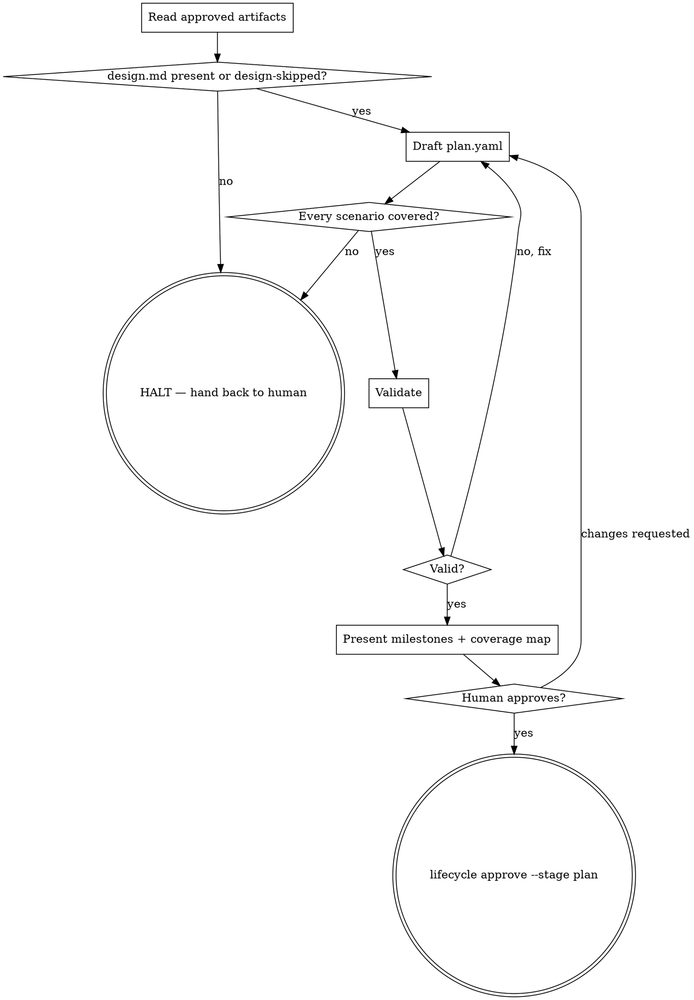

# Lifecycle Skills Rewrite — Implementation Plan

> **For agentic workers:** REQUIRED SUB-SKILL: Use superpowers:subagent-driven-development (recommended) or superpowers:executing-plans to implement this plan task-by-task. Steps use checkbox (`- [ ]`) syntax for tracking.

**Goal:** Ship the pilot slice of the skills rewrite — a new `/lifecycle-plan` skill, `plan-author`'s self-containment bar, a mechanical drift check in both repos, and the four verified correctness defects fixed.

**Architecture:** Two independent repos, executed in order. `milestoned-plan-dag` first (it owns the plan grammar and the quality bar `/lifecycle-plan` delegates to), then `spec-lifecycle` (the drift check, the four fixes, `design.md`'s Components section, and the new skill). Correctness is enforced two ways: a deterministic drift test that parses every CLI invocation out of the skills and checks it against the CLI's own registered command tree, and an on-demand subagent eval that grades a produced `plan.yaml` for validity, scenario coverage, and self-containment.

**Tech Stack:** Go 1.25+ (both repos, `go test ./...`), `urfave/cli/v3` (spec-lifecycle's command tree), JSON Schema + YAML (mpd's plan format), markdown skills with YAML frontmatter.

**Source design:** [`tasks/lifecycle-skills-rewrite-design.md`](../lifecycle-skills-rewrite-design.md) (commit `be92fae`).

---

## Scope and assumptions

**In scope (this plan):** the pilot slice from the design's Build order — `/lifecycle-plan` end to end, `plan-author`'s quality-bar changes, the drift check in both repos, the eval fixture — plus the four correctness defects (design D6).

**Out of scope (next plan):** rewriting the remaining five skills (`lifecycle-refine`, `lifecycle-design`, `lifecycle-init`, `lifecycle-new-feature`, `lifecycle-bug`, `lifecycle-archive`) against the proven pattern. This plan only makes the four *correctness* edits to them; their full rewrite waits until the pilot's eval passes. That follow-up change is the one to route through spec-lifecycle's own gated lifecycle, using the freshly written `/lifecycle-plan`.

**Process (decided 2026-08-11):** this plan executes as ordinary PRs in each repo, not as a gated `spec-lifecycle` change. Rationale: the plan-stage skill cannot gate the change that writes it. Consequence to accept: `openspec/specs/plan-integration` gains no requirement declaring the plan-stage skill shipped until the follow-up change archives.

**Two additions beyond the design doc**, both discovered while grounding this plan:

1. The drift check must cover **inline code spans**, not only fenced blocks as the design says. Defect D6.1 (`lifecycle validate --stage repro`) lives in an inline span in prose; a fenced-only extractor would not catch it, and the design explicitly claims the check catches D6.1. Task 5 implements both.
2. `spec-lifecycle`'s own `openspec/schemas/kentra-spec-lifecycle/` tree is **stale pre-YAML-flip**: it still declares a `tasks` artifact generating `tasks.md`, an `apply` block tracking it, markdown `specs/**/spec.md` deltas, and it still ships `templates/tasks.md`. The shipped/embedded descriptor (`internal/schema/`) is correct — only the installed copy drifted, because `lifecycle init` installs the descriptor **only when `schema.yaml` is absent** and never refreshes it. This violates the repo's own archived requirement ("the schema descriptor SHALL NOT declare a `tasks.md` template or a `tasks` artifact", `openspec/specs/plan-integration`), and it matters here because the skills tell agents to fill artifacts *from those templates* — D3's new Components section would never reach the repo that needs it. Task 11 fixes the tree and adds a permanent guard.

---

## File structure

### `milestoned-plan-dag`

| Path | Action | Responsibility |
|---|---|---|
| `skills/plan-author/SKILL.md` | modify | Adds the self-containment bar; rewrites the `check` and `criteria` bullets so `check` is the repo's standard validation command and `criteria` is a named-test list. |
| `skills/plan-author/example.yaml` | modify | The worked example now demonstrates the bar it teaches: structured deliverables with responsibilities, named-test criteria, one standard `check`. |
| `cmd/milestoned-plan-dag/main.go` | modify | Extracts the subcommand switch into a `commands` map so the command set is data a test can walk. |
| `cmd/milestoned-plan-dag/skilldrift_test.go` | create | Extracts every `milestoned-plan-dag …` invocation from the skill and checks each subcommand against `commands`. Also validates `example.yaml` against the real validator and asserts it meets the bar. |

### `spec-lifecycle`

| Path | Action | Responsibility |
|---|---|---|
| `cmd/lifecycle/main.go` | modify | Extracts `rootCommand()` so the command tree is reachable from a test. |
| `cmd/lifecycle/skilldrift_test.go` | create | The drift check: parses CLI invocations out of every embedded skill and validates subcommand, flag, and `--stage` value against the live command tree and the real stage enums. |
| `skills/lifecycle-bug/SKILL.md` | modify | Defect 1 — remove the two `validate --stage repro|fix` calls the CLI rejects. |
| `skills/lifecycle-archive/SKILL.md` | modify | Defect 2 — a bug's `repro` and `fix` gates are both unconditional. |
| `skills/lifecycle-init/SKILL.md` | modify | Defect 3 — resolve the "stop" vs "idempotent" contradiction. |
| `skills/lifecycle-new-feature/SKILL.md` | modify | Defect 4 — `gh issue create --repo`, sourced from `lifecycle.yml`; mention `designSkip`. |
| `skills/lifecycle-plan/SKILL.md` | create | The new plan-stage driver: the scenario→criterion→test chain, the design.md projection, HALT conditions, gate 3. |
| `skills/lifecycle-design/SKILL.md` | modify | Names the new Components & Interfaces section among design.md's outputs. |
| `internal/schema/templates/design.md` | modify | Gains the Components & Interfaces section (the shipped template). |
| `internal/schema/schema.yaml` | modify | Descriptor's `design` instruction names the new section. |
| `internal/schema/schema.go` | modify | Package doc still says "proposal -> specs -> design -> tasks" and "four artifact templates" — both stale. |
| `internal/schema/schema_test.go` | modify | Adds `TestInstalledDescriptorMatchesEmbedded` — the repo's own installed tree must equal the embedded assets. |
| `openspec/schemas/kentra-spec-lifecycle/**` | modify | Refreshed from the embedded assets; `templates/tasks.md` deleted. |
| `internal/scaffold/skills_test.go` | modify | 6 skills → 7. |
| `internal/scaffold/init_test.go` | modify | Same skill list. |
| `internal/validate/doc.go` | modify | Stage map still reads `plan -> tasks.md`. |
| `evals/lifecycle-plan/README.md` | create | The eval protocol: the prompt, the three pass conditions, how to run it. |
| `evals/lifecycle-plan/fixture/**` | create | A gate-approved change folder: proposal, spec delta with three scenarios, design.md with a real Components section, approval-state.json. |
| `evals/coverage_test.go` | create | Env-gated mechanical check: every delta scenario is discharged by some milestone criterion. |

**Trap to respect:** `embed.go` embeds the whole `skills/` directory and `internal/scaffold.skillNames()` treats *every directory entry under `skills/`* as a skill. Never add a non-skill subdirectory under `skills/` — that is why the eval fixture lives at `evals/`, not `skills/lifecycle-plan/eval/`.

---

## Phase 1 — milestoned-plan-dag

### Task 1: Make the mpd command set walkable data

**Files:**
- Modify: `cmd/milestoned-plan-dag/main.go`

- [ ] **Step 1: Replace the dispatch switch with a map**

In `cmd/milestoned-plan-dag/main.go`, replace the body of `run` and add the map above it:

```go
// commands is the CLI's subcommand set, as data rather than a switch, so
// tests (and the usage text) can enumerate it. Adding a subcommand here is
// the single edit that makes it dispatchable and drift-checkable.
var commands = map[string]func([]string) int{
	"validate": validateCmd,
	"resolve":  resolveCmd,
	"render":   renderCmd,
}

// run dispatches on the first argument and returns a process exit code. It is
// factored out of main so it can be exercised without terminating the process.
func run(args []string) int {
	if len(args) == 0 {
		fmt.Fprint(os.Stderr, usage)
		return 2
	}

	switch args[0] {
	case "-h", "--help", "help":
		fmt.Fprint(os.Stdout, usage)
		return 0
	}

	cmd, ok := commands[args[0]]
	if !ok {
		fmt.Fprintf(os.Stderr, "milestoned-plan-dag: unknown command %q\n\n%s", args[0], usage)
		return 2
	}
	return cmd(args[1:])
}
```

- [ ] **Step 2: Verify nothing changed behaviourally**

Run: `go build ./... && go vet ./... && go test ./...`
Expected: PASS, no output changes.

- [ ] **Step 3: Commit**

```bash
git add cmd/milestoned-plan-dag/main.go
git commit -m "refactor: make the subcommand set a map so tests can enumerate it"
```

---

### Task 2: Drift check over plan-author

**Files:**
- Create: `cmd/milestoned-plan-dag/skilldrift_test.go`

- [ ] **Step 1: Write the failing test**

Create `cmd/milestoned-plan-dag/skilldrift_test.go`:

```go
package main

import (
	"os"
	"regexp"
	"strings"
	"testing"
)

// skillPath is the authoring skill this CLI ships. It is the one document
// that instructs an agent which commands to run, so every invocation in it
// must name a subcommand this binary actually dispatches.
const skillPath = "../../skills/plan-author/SKILL.md"

// inlineSpan matches a markdown inline code span. Invocations appear both
// in fenced blocks and inline in prose, and a drift check that reads only
// one of the two misses half the document.
var inlineSpan = regexp.MustCompile("`([^`\n]+)`")

// invocations returns every line of md that starts with the CLI's name,
// looking inside both fenced code blocks and inline code spans.
func invocations(md, bin string) []string {
	var out []string
	add := func(s string) {
		if strings.HasPrefix(strings.TrimSpace(s), bin+" ") {
			out = append(out, strings.TrimSpace(s))
		}
	}

	inFence := false
	for _, line := range strings.Split(md, "\n") {
		if strings.HasPrefix(strings.TrimSpace(line), "```") {
			inFence = !inFence
			continue
		}
		if inFence {
			add(line)
			continue
		}
		for _, m := range inlineSpan.FindAllStringSubmatch(line, -1) {
			add(m[1])
		}
	}
	return out
}

func TestSkillInvocationsNameRealCommands(t *testing.T) {
	data, err := os.ReadFile(skillPath)
	if err != nil {
		t.Fatalf("reading %s: %v", skillPath, err)
	}

	found := invocations(string(data), "milestoned-plan-dag")
	if len(found) == 0 {
		t.Fatalf("no milestoned-plan-dag invocations found in %s — the extractor is broken, not the skill", skillPath)
	}

	for _, inv := range found {
		fields := strings.Fields(inv)
		sub := fields[1]
		if strings.HasPrefix(sub, "-") {
			continue // `milestoned-plan-dag --help` and friends
		}
		if _, ok := commands[sub]; !ok {
			t.Errorf("%s: %q names subcommand %q, which this CLI does not dispatch (have %v)",
				skillPath, inv, sub, commandNames())
		}
	}
}

func TestExtractorFindsBothSpanKinds(t *testing.T) {
	md := "prose with `milestoned-plan-dag bogus plan.yaml` inline\n" +
		"```\nmilestoned-plan-dag validate plan.yaml\n```\n"
	got := invocations(md, "milestoned-plan-dag")
	if len(got) != 2 {
		t.Fatalf("invocations() = %v, want 2 (one inline, one fenced)", got)
	}
}

func commandNames() []string {
	names := make([]string, 0, len(commands))
	for n := range commands {
		names = append(names, n)
	}
	return names
}
```

- [ ] **Step 2: Run it to see the extractor half fail first**

Temporarily break the extractor's fence handling — change `inFence = !inFence` to `inFence = false` — then run:

Run: `go test ./cmd/milestoned-plan-dag/ -run TestExtractorFindsBothSpanKinds -v`
Expected: FAIL with `invocations() = [...] want 2`.

Restore `inFence = !inFence`.

- [ ] **Step 3: Run both tests green**

Run: `go test ./cmd/milestoned-plan-dag/ -v`
Expected: PASS. `TestSkillInvocationsNameRealCommands` passes today — `plan-author` only names `validate`, `resolve`, `render`.

- [ ] **Step 4: Commit**

```bash
git add cmd/milestoned-plan-dag/skilldrift_test.go
git commit -m "test: fail CI when plan-author names a subcommand the CLI does not dispatch"
```

---

### Task 3: Give plan-author the self-containment bar

**Files:**
- Modify: `skills/plan-author/SKILL.md`

- [ ] **Step 1: Add the bar section**

Insert immediately after the "Scope: one plan = one git repository" section (before "## Top-level shape"):

```markdown
## Self-contained is the bar

A milestone is read **alone** — by an implementer who has this repository, this
one milestone, and nothing else. It has to carry enough to start work without
opening another document or asking a question.

- **Names, not references.** `deliverables` lists the file paths this milestone
  produces and, for each, the class or function it introduces and its one-line
  responsibility. "As described in the design doc" is not a deliverable.
- **Criteria written out.** Each criterion states its `given`/`when`/`then` in
  full and `name`s the test that proves it. A criterion that points elsewhere
  for its detail is not self-contained.
- **Everything else is prose, kept short.** Precision lives in the names and the
  criteria; the surrounding text only has to be clear enough to act on.

Test it by reading one milestone with the rest of the plan covered. If you would
have to ask a question before starting, that milestone is not done.
```

- [ ] **Step 2: Rewrite the `check` bullet**

In "### The contract: `check` / `criteria` / `paths`", replace the `check` bullet with:

```markdown
- **`check`** — the command that proves the milestone did not break the
  repository: normally **the project's standard validation command**, the one a
  maintainer runs before pushing (`./gradlew clean test`, `go test ./...`,
  `npm test`). The same command on every milestone is the expected shape, not a
  smell — it proves nothing regressed *and* that this milestone's new tests ran
  inside the real suite rather than under an isolating filter. Per-milestone
  specificity belongs in `criteria`, which names the tests. The sentinel
  **`none`** is for a milestone whose outcome genuinely has no automated proof
  (a design note, a decision record) — a *conscious* escape, not a default.
  `check` must not be blank.
```

- [ ] **Step 3: Rewrite the `criteria` bullet**

Replace the `criteria` bullet with:

```markdown
- **`criteria`** — the pass/fail statement a verifier grades the milestone
  against. Prefer the structured list: one entry per behaviour this milestone
  delivers, `then` required, `name` carrying the **test identity** (the file and
  test name that proves it), `given`/`when` written out in full:

  ```yaml
  criteria:
    - name: internal/plan/load_test.go::TestLoadRejectsDuplicateSlug
      given: a plan with two milestones sharing a slug
      when: it is loaded
      then: loading fails and names the duplicated slug
  ```

  A bare string is allowed and stays valid, but it gives the verifier nothing to
  check the milestone *did* anything — reach for it only where there is genuinely
  no test to name. `criteria` must be non-empty.
```

- [ ] **Step 4: Verify the skill still drift-checks clean**

Run: `go test ./cmd/milestoned-plan-dag/ -v`
Expected: PASS.

- [ ] **Step 5: Commit**

```bash
git add skills/plan-author/SKILL.md
git commit -m "docs(plan-author): add the self-containment bar; check is the standard command, criteria name tests"
```

---

### Task 4: Make the worked example meet the bar it teaches

**Files:**
- Modify: `skills/plan-author/example.yaml`
- Modify: `cmd/milestoned-plan-dag/skilldrift_test.go`

- [ ] **Step 1: Write the failing test**

Append to `cmd/milestoned-plan-dag/skilldrift_test.go`:

```go
// TestExampleMeetsTheBar holds the worked example to the standard the skill
// teaches: it is the artifact agents copy, so a stale example is a quality
// regression the prose cannot catch.
func TestExampleMeetsTheBar(t *testing.T) {
	data, err := os.ReadFile("../../skills/plan-author/example.yaml")
	if err != nil {
		t.Fatalf("reading example.yaml: %v", err)
	}

	res, _ := validate.Validate(data)
	if !res.OK() {
		t.Fatalf("example.yaml is invalid: %v", res.Errors)
	}

	var doc struct {
		Milestones []struct {
			Slug     string `yaml:"slug"`
			Contract struct {
				Check    string      `yaml:"check"`
				Criteria interface{} `yaml:"criteria"`
			} `yaml:"contract"`
		} `yaml:"milestones"`
	}
	if err := yaml.Unmarshal(data, &doc); err != nil {
		t.Fatalf("parsing example.yaml: %v", err)
	}

	named := 0
	for _, m := range doc.Milestones {
		if list, ok := m.Contract.Criteria.([]interface{}); ok && len(list) > 0 {
			named++
		}
		if m.Contract.Check == "" {
			t.Errorf("milestone %q: empty check", m.Slug)
		}
	}
	if named < 2 {
		t.Errorf("example.yaml demonstrates structured named criteria on %d milestone(s), want at least 2 — "+
			"the example must show the shape the skill asks for", named)
	}
}
```

Add the imports it needs at the top of the file:

```go
	"gopkg.in/yaml.v3"

	"milestoned-plan-dag/internal/validate"
```

- [ ] **Step 2: Run it to verify it fails**

Run: `go test ./cmd/milestoned-plan-dag/ -run TestExampleMeetsTheBar -v`
Expected: FAIL — `demonstrates structured named criteria on 0 milestone(s), want at least 2` (today every milestone uses a bare criteria string).

- [ ] **Step 3: Update the example**

Rewrite `skills/plan-author/example.yaml` milestones 1, 3 and 4 so the example shows the bar. Replace the file's milestone list with:

```yaml
milestones:
  - number: 1
    slug: scaffold
    goal: Stand up the widget module scaffold
    deliverables:
      create:
        - go.mod
        - cmd/widget/main.go   # CLI entrypoint; dispatches to internal/widget
    contract:
      check: go test ./...
      criteria:
        - name: cmd/widget/main_test.go::TestUsageOnNoArgs
          given: the widget binary
          when: it is run with no arguments
          then: it prints usage and exits 2
      paths:
        - go.mod
        - cmd/**
    steps:
      - "[x] go mod init"
      - "[x] add the CLI dispatch skeleton"

  - number: 2
    slug: design-note
    goal: Record the widget's trade-off decision
    deliverables: A short design note explaining the chosen approach.
    contract:
      # No automated proof for a design note — a conscious escape, not a
      # default. Declares no depends-on, so it implicitly follows milestone 1
      # (scaffold) in document order.
      check: none
      criteria: The note explains the trade-off clearly enough for a reviewer to judge.
      paths:
        - docs/**
    steps:
      - "[ ] write the design note"

  - number: 3
    slug: widget-api
    goal: Implement the widget API on top of the scaffold
    deliverables:
      create:
        - internal/widget/api.go   # type API; validates and stores widgets
      test:
        - internal/widget/api_test.go
    contract:
      # The project's standard validation command — the same one milestone 1
      # runs. Nothing regressed, and the tests named below ran in the real suite.
      check: go test ./...
      criteria:
        - name: internal/widget/api_test.go::TestCreateRejectsEmptyName
          given: an API with an empty store
          when: Create is called with an empty name
          then: it returns ErrInvalidName and stores nothing
        - name: internal/widget/api_test.go::TestCreateStoresWidget
          given: an API with an empty store
          when: Create is called with a valid name
          then: the widget is retrievable by its returned id
      paths:
        - internal/widget/**
    depends-on:
      - scaffold
    steps:
      - "[ ] define the API surface"
      - "[ ] implement it"

  - number: 4
    slug: review-gate
    goal: Confirm the widget module is ready to ship, with no further changes
    deliverables: No files change; this milestone only runs a review check.
    contract:
      check: test -f docs/design.md && test -f internal/widget/api.go
      criteria:
        - name: manual review
          given: the design note and the widget API are both committed
          when: a reviewer inspects the module before shipping
          then: both artifacts exist and no source file changed in this milestone
      # Empty write-set — a conscious escape meaning this milestone's diff
      # must be empty; it only verifies work done by earlier milestones.
      paths: []
    depends-on:
      - design-note
      - widget-api
    steps:
      - "[ ] confirm the design note and the widget API are both in place"
```

Keep lines 1–7 (the `$schema` pin and the header comment), changing only the
"exercising:" list to name the new shape:

```yaml
# A small worked example exercising: explicit slugs, an implicit-chain edge
# (milestone 2 declares no depends-on, so it inherits an edge on milestone 1),
# a branching + merging DAG, named-test criteria against one standard check,
# both contract "conscious escapes" (check: none and paths: []), and a mix of
# done/not-done checkbox steps.
```

- [ ] **Step 4: Run the tests to verify they pass**

Run: `go test ./cmd/milestoned-plan-dag/ -v && go run ./cmd/milestoned-plan-dag validate skills/plan-author/example.yaml`
Expected: PASS, and `skills/plan-author/example.yaml is valid`.

- [ ] **Step 5: Commit**

```bash
git add skills/plan-author/example.yaml cmd/milestoned-plan-dag/skilldrift_test.go
git commit -m "docs(plan-author): worked example demonstrates named-test criteria and a standard check"
```

- [ ] **Step 6: Push the mpd branch and open the PR**

```bash
git push -u origin HEAD
gh pr create --repo kentra-io/milestoned-plan-dag \
  --title "plan-author: self-containment bar + skill drift check" \
  --body "Adds the self-containment bar, makes check the repo's standard validation command and criteria a named-test list, brings the worked example up to that bar, and adds a drift test that fails CI when the skill names a subcommand the CLI does not dispatch."
```

---

## Phase 2 — spec-lifecycle: the drift check and the four defects

### Task 5: Extract the command tree and write the drift check

**Files:**
- Modify: `cmd/lifecycle/main.go`
- Create: `cmd/lifecycle/skilldrift_test.go`

- [ ] **Step 1: Extract `rootCommand()`**

In `cmd/lifecycle/main.go`, replace `run` with:

```go
// rootCommand builds the CLI's command tree. It is factored out of run so a
// test can walk the real registered commands and flags rather than a
// hand-maintained copy of them (see skilldrift_test.go).
func rootCommand() *cli.Command {
	return &cli.Command{
		Name:    "lifecycle",
		Usage:   "stage-gated OpenSpec-format change lifecycle",
		Version: buildVersion(),
		Commands: []*cli.Command{
			initCommand(),
			validateCommand(),
			approveCommand(),
			statusCommand(),
			archiveCommand(),
			guardCommand(),
		},
	}
}

func run(ctx context.Context, args []string) error {
	return rootCommand().Run(ctx, args)
}
```

- [ ] **Step 2: Verify the refactor is inert**

Run: `go build ./... && go test ./cmd/lifecycle/ -count=1`
Expected: PASS — every existing testscript still passes.

- [ ] **Step 3: Write the drift check**

Create `cmd/lifecycle/skilldrift_test.go`:

```go
package main

import (
	"io/fs"
	"regexp"
	"strings"
	"testing"

	"github.com/urfave/cli/v3"

	root "github.com/kentra-io/spec-lifecycle"
	"github.com/kentra-io/spec-lifecycle/internal/approve"
	"github.com/kentra-io/spec-lifecycle/internal/validate"
)

// The drift check: every `lifecycle …` invocation printed in a shipped skill
// must name a subcommand this binary registers, a flag that subcommand
// accepts, and — where the value is an enumeration the CLI owns in Go — a
// value the CLI accepts. It reads the command tree, never a copy of it, so
// it cannot itself go stale.
//
// Deliberately one-directional: it catches a skill instructing something the
// CLI rejects, not a CLI flag no skill mentions. Nothing is executed, so
// approve/archive/init are checked without being run.

var inlineSpan = regexp.MustCompile("`([^`\n]+)`")

// enums are the flag values the CLI validates against an exported Go slice.
// Only those appear here: hardcoding an enumeration that lives as string
// literals inside a command would just be a second copy to drift.
func enums() map[string]map[string][]string {
	validateStages := make([]string, 0, len(validate.Stages))
	for _, s := range validate.Stages {
		validateStages = append(validateStages, string(s))
	}
	approveStages := make([]string, 0, len(approve.Stages))
	for _, s := range approve.Stages {
		approveStages = append(approveStages, string(s))
	}
	return map[string]map[string][]string{
		"validate": {"stage": validateStages},
		"approve":  {"stage": approveStages},
	}
}

// invocations returns every line of md whose first word is bin, looking
// inside both fenced code blocks and inline code spans — skills instruct
// commands in both, and D6.1 lived in an inline span.
func invocations(md, bin string) []string {
	var out []string
	add := func(s string) {
		if strings.HasPrefix(strings.TrimSpace(s), bin+" ") {
			out = append(out, strings.TrimSpace(s))
		}
	}
	inFence := false
	for _, line := range strings.Split(md, "\n") {
		if strings.HasPrefix(strings.TrimSpace(line), "```") {
			inFence = !inFence
			continue
		}
		if inFence {
			add(line)
			continue
		}
		for _, m := range inlineSpan.FindAllStringSubmatch(line, -1) {
			add(m[1])
		}
	}
	return out
}

// placeholder reports whether tok is documentation shorthand rather than a
// literal value: <change>, <owner>/<repo>, or an alternation like text|json.
func placeholder(tok string) bool {
	return tok == "" || strings.HasPrefix(tok, "<") || strings.Contains(tok, "|")
}

func normalize(tok string) string { return strings.Trim(tok, "[]`\"'") }

func TestSkillsNameRealCommands(t *testing.T) {
	tree := map[string]*cli.Command{}
	for _, c := range rootCommand().Commands {
		tree[c.Name] = c
	}
	table := enums()

	err := fs.WalkDir(root.SkillsFS, "skills", func(p string, d fs.DirEntry, err error) error {
		if err != nil || d.IsDir() || !strings.HasSuffix(p, "SKILL.md") {
			return err
		}
		data, err := root.SkillsFS.ReadFile(p)
		if err != nil {
			return err
		}
		for _, inv := range invocations(string(data), "lifecycle") {
			checkInvocation(t, tree, table, p, inv)
		}
		return nil
	})
	if err != nil {
		t.Fatalf("walking embedded skills: %v", err)
	}
}

func checkInvocation(t *testing.T, tree map[string]*cli.Command, table map[string]map[string][]string, file, inv string) {
	t.Helper()
	fields := strings.Fields(inv)
	if len(fields) < 2 {
		return
	}
	name := normalize(fields[1])
	if strings.HasPrefix(name, "-") {
		return // `lifecycle --version`
	}
	cmd, ok := tree[name]
	if !ok {
		t.Errorf("%s: %q names subcommand %q, which the CLI does not register", file, inv, name)
		return
	}

	accepted := map[string]bool{}
	for _, f := range cmd.Flags {
		for _, n := range f.Names() {
			accepted[n] = true
		}
	}

	rest := fields[2:]
	for i := 0; i < len(rest); i++ {
		tok := normalize(rest[i])
		if !strings.HasPrefix(tok, "--") {
			continue
		}
		flag := strings.TrimPrefix(tok, "--")
		value := ""
		if eq := strings.Index(flag, "="); eq >= 0 {
			flag, value = flag[:eq], flag[eq+1:]
		} else if i+1 < len(rest) && !strings.HasPrefix(normalize(rest[i+1]), "-") {
			value = normalize(rest[i+1])
		}
		if !accepted[flag] {
			t.Errorf("%s: %q passes --%s, which `lifecycle %s` does not accept", file, inv, flag, name)
			continue
		}
		allowed, checked := table[name][flag]
		if !checked || placeholder(value) {
			continue
		}
		if !contains(allowed, value) {
			t.Errorf("%s: %q passes --%s %s, but `lifecycle %s` accepts only %v",
				file, inv, flag, value, name, allowed)
		}
	}
}

func contains(hay []string, needle string) bool {
	for _, h := range hay {
		if h == needle {
			return true
		}
	}
	return false
}
```

- [ ] **Step 4: Run it to verify it fails on the real defect**

Run: `go test ./cmd/lifecycle/ -run TestSkillsNameRealCommands -v`
Expected: FAIL with two errors naming `skills/lifecycle-bug/SKILL.md`:

```
skills/lifecycle-bug/SKILL.md: "lifecycle validate --stage repro" passes --stage repro, but `lifecycle validate` accepts only [refine design plan]
skills/lifecycle-bug/SKILL.md: "lifecycle validate --stage fix" passes --stage fix, but `lifecycle validate` accepts only [refine design plan]
```

- [ ] **Step 5: Commit the check while it is still red**

The failing test is the evidence for the next task. Commit it on its own so the fix commit shows the transition.

```bash
git add cmd/lifecycle/main.go cmd/lifecycle/skilldrift_test.go
git commit -m "test: check every shipped skill's CLI invocations against the real command tree

Currently RED: lifecycle-bug instructs \`lifecycle validate --stage repro|fix\`,
which the CLI rejects. Fixed in the next commit."
```

---

### Task 6: Defect 1 — lifecycle-bug instructs a rejected command

**Files:**
- Modify: `skills/lifecycle-bug/SKILL.md:44-53`

- [ ] **Step 1: Confirm the CLI's actual contract**

Run: `go run ./cmd/lifecycle validate --stage repro; echo "exit=$?"`
Expected: `validate: --stage must be one of [refine design plan] (got "repro")`, `exit=2`.

Run: `grep -n 'Stages = ' internal/approve/types.go`
Expected: `var Stages = []Stage{StageRefine, StageDesign, StagePlan, StageRepro, StageFix}` — `approve` takes `repro`/`fix`; `validate` does not.

- [ ] **Step 2: Rewrite the gate mechanics section**

Replace `skills/lifecycle-bug/SKILL.md`'s "## Gate mechanics" steps 1–3 with:

```markdown
1. Reproduce the bug. Write the failing test before touching the fix.
   If you cannot reproduce it, stop here and surface `Needs Input` to the
   human — do not proceed on a guessed diagnosis.
2. Surface the repro and its failing test to the human. On their explicit
   approval, run:
   ```
   lifecycle approve --stage repro --approve <change>
   ```
   `lifecycle validate` covers the three feature-flow stages only
   (`refine`, `design`, `plan`); the repro gate has no separate validate
   step. If this bug turned out to be spec-affecting and you added a
   `specs/<capability>/spec.yaml` delta, validate that delta with
   `lifecycle validate --stage refine --change <change>` before approving.
3. Implement the fix and confirm the repro test now passes with no
   regressions. Surface that to the human, and on their explicit approval
   run:
   ```
   lifecycle approve --stage fix --approve <change>
   ```
```

- [ ] **Step 3: Run the drift check to verify it goes green**

Run: `go test ./cmd/lifecycle/ -run TestSkillsNameRealCommands -v`
Expected: PASS.

- [ ] **Step 4: Commit**

```bash
git add skills/lifecycle-bug/SKILL.md
git commit -m "fix(lifecycle-bug): drop the validate --stage repro|fix calls the CLI rejects"
```

---

### Task 7: Defect 2 — archive misstates the bug gate set

**Files:**
- Modify: `skills/lifecycle-archive/SKILL.md:14-17`

- [ ] **Step 1: Confirm the gate set is unconditional**

Run: `go test ./internal/status/ -run TestRequiredStages -v 2>&1 | head -20`
Expected: PASS. Read `internal/status/status_test.go:201` — a bug's required stages are asserted as 2 (`repro`, `fix`), with no conditionality on whether the fix stage ran.

- [ ] **Step 2: Correct the sentence**

In `skills/lifecycle-archive/SKILL.md` step 1, replace:

```
For a bug: `repro` (and `fix`, if the fix stage ran) must show `approved`;
```

with:

```
For a bug: both `repro` and `fix` must show `approved` — a bug's gate set is
unconditional, so an unapproved `fix` blocks the archive even when the fix is
already committed;
```

- [ ] **Step 3: Verify**

Run: `go test ./... -count=1`
Expected: PASS.

- [ ] **Step 4: Commit**

```bash
git add skills/lifecycle-archive/SKILL.md
git commit -m "fix(lifecycle-archive): a bug's repro and fix gates are both unconditional"
```

---

### Task 8: Defect 3 — init contradicts itself on re-runs

**Files:**
- Modify: `skills/lifecycle-init/SKILL.md:17-21`

- [ ] **Step 1: Replace the contradictory paragraph**

`SKILL.md` line 19 says an existing `lifecycle.yml` means "say so and stop"; line 57 says "every step is independently idempotent". Replace the whole paragraph beginning "First check the state of the repo:" with:

```markdown
First read the state of the repo. If `lifecycle.yml` already exists, this
project is initialized: tell the human what is already there and ask whether
they want a refresh before running anything. A re-run is safe — it refreshes
scaffolding and skills and leaves `lifecycle.yml`, in-flight changes, gate
records, and the archive ledger untouched — so the reason to ask is consent,
not risk.
```

- [ ] **Step 2: Verify the claim about what a re-run touches**

Run: `grep -n "EnsureProjectConfig\|schema.Install\|marker" internal/scaffold/init.go | head`
Expected: the schema is installed only when its `schema.yaml` marker is absent, and `lifecycle.yml` seeding is guarded the same way — confirming "leaves lifecycle.yml untouched". (Task 11 addresses the fact that the schema tree is therefore never *refreshed* either.)

- [ ] **Step 3: Commit**

```bash
git add skills/lifecycle-init/SKILL.md
git commit -m "fix(lifecycle-init): reconcile 'stop on existing lifecycle.yml' with idempotent re-runs"
```

---

### Task 9: Defect 4 — new-feature files issues into the wrong repo

**Files:**
- Modify: `skills/lifecycle-new-feature/SKILL.md:37-46`

- [ ] **Step 1: Fix the `gh` invocation**

Replace the fenced block and the sentence after it in step 2 with:

```markdown
   Once confirmed, read `sourceTracking.repo` from `lifecycle.yml` and pass it
   explicitly — `gh` otherwise infers the repo from the current directory's
   git remote, which files the issue against whatever repo you happen to be
   standing in:
   ```
   gh issue create --repo <owner>/<repo> --title "<title>" --body "<body>"
   ```
   If `sourceTracking.type` is `none` or `repo` is empty, stop and ask the
   human which repo the issue belongs to — do not guess from the remote.
   `gh` prints the new issue's URL
   (`https://github.com/<owner>/<repo>/issues/<n>`); derive the
   `<owner>/<repo>#<n>` reference from it. This is the `issue:` value the
   seeded `proposal.md` and, later, `refine`'s full proposal both key off.
```

- [ ] **Step 2: Add the designSkip hand-off**

Append to step 4 ("Stop and hand off"), after the existing text:

```markdown
   Mention `designSkip` to the human when handing off: refine may propose
   skipping the design stage for small, local, architecturally inert work,
   and the human approves or rejects that proposal at gate 1. Work that
   needs class-level design is never design-skippable — the components live
   in `design.md`, and the plan stage projects them into milestones.
```

- [ ] **Step 3: Verify the drift check still passes**

Run: `go test ./cmd/lifecycle/ -count=1`
Expected: PASS (`gh` invocations are not `lifecycle` invocations, so the check ignores them; this confirms nothing else broke).

- [ ] **Step 4: Commit**

```bash
git add skills/lifecycle-new-feature/SKILL.md
git commit -m "fix(lifecycle-new-feature): pass gh issue create --repo from lifecycle.yml; mention designSkip"
```

---

## Phase 3 — spec-lifecycle: components, the descriptor, and the plan skill

### Task 10: design.md gains a Components & Interfaces section

**Files:**
- Modify: `internal/schema/templates/design.md`
- Modify: `internal/schema/schema.yaml`
- Modify: `skills/lifecycle-design/SKILL.md:20-27`

- [ ] **Step 1: Add the section to the shipped template**

In `internal/schema/templates/design.md`, insert between `## Decisions` and `## NFR Discharge`:

```markdown
## Components & Interfaces

<!-- The approved decomposition: every component this change creates or
     modifies, with its file, its type/class name, its one-line
     responsibility, and the interface it exposes to the others. This is the
     source of truth the plan stage projects into each milestone's
     deliverables — the implementer gets the names from the milestone and
     comes back here only for the rationale. Work that cannot be decomposed
     here is not design-skippable. Write "(none — no new components)" if this
     change introduces none. -->

| Component | File | Responsibility |
|---|---|---|
| `<Name>` | `<path>` | <one line> |
```

- [ ] **Step 2: Name it in the descriptor's design instruction**

In `internal/schema/schema.yaml`, in the `design` artifact's `instruction`, change the sentence beginning "Sections: Context, Goals/Non-Goals, Decisions" to list the new section:

```
      Sections: Context, Goals/Non-Goals, Decisions (with alternatives
      considered), **Components & Interfaces** (every component this change
      creates or modifies — file, name, one-line responsibility — the
      decomposition the plan stage projects into milestone deliverables),
      **NFR Discharge** (how every NFR declared in this
```

- [ ] **Step 3: Name it in the design skill**

In `skills/lifecycle-design/SKILL.md`, "## What this stage produces", change the opening to:

```markdown
`design.md` — Context, Goals/Non-Goals, Decisions (with alternatives
considered), a **Components & Interfaces** section naming every component this
change creates or modifies (file, name, one-line responsibility) — this is the
decomposition the plan stage projects into milestone deliverables, so a change
whose components you cannot name here was not design-skippable — an explicit
**NFR Discharge** section accounting for every NFR
```

- [ ] **Step 4: Run the schema tests**

Run: `go test ./internal/schema/ -count=1 -v`
Expected: PASS. (`relPaths` enumerates the embedded assets dynamically, so adding content to an existing template needs no test list update.)

- [ ] **Step 5: Commit**

```bash
git add internal/schema/templates/design.md internal/schema/schema.yaml skills/lifecycle-design/SKILL.md
git commit -m "feat(schema): design.md carries a Components & Interfaces section"
```

---

### Task 11: Refresh this repo's own installed descriptor and guard it

**Files:**
- Modify: `internal/schema/schema_test.go`
- Modify: `internal/schema/schema.go:1-30`
- Modify: `internal/validate/doc.go:20-35`
- Modify/Delete: `openspec/schemas/kentra-spec-lifecycle/**`

- [ ] **Step 1: Write the failing guard test**

Append to `internal/schema/schema_test.go`:

```go
// TestInstalledDescriptorMatchesEmbedded dogfoods the descriptor: this repo
// plans itself through its own openspec/ tree, so its installed descriptor
// must equal what the binary ships. `lifecycle init` installs the descriptor
// only when its marker file is absent and never refreshes it, so without this
// guard the repo's own tree silently rots — which is exactly what happened
// after change 007 (it kept a pre-flip `tasks` artifact and a tasks.md
// template, violating openspec/specs/plan-integration's own requirement).
func TestInstalledDescriptorMatchesEmbedded(t *testing.T) {
	mismatches, err := Verify("../..")
	if err != nil {
		t.Fatalf("Verify: %v", err)
	}
	for _, m := range mismatches {
		t.Errorf("openspec/schemas/%s/%s: %s — re-copy it from internal/schema/", Name, m.Rel, m.Reason)
	}

	// Verify reports "missing" and "modified" only — it never reports a file
	// the descriptor no longer ships. templates/tasks.md is exactly that case
	// (retired by change 007, still installed), so check for extras directly.
	embedded := map[string]bool{}
	rels, err := relPaths()
	if err != nil {
		t.Fatalf("relPaths: %v", err)
	}
	for _, r := range rels {
		embedded[r] = true
	}
	installed := Dir("../..")
	err = filepath.WalkDir(installed, func(p string, d fs.DirEntry, err error) error {
		if err != nil || d.IsDir() {
			return err
		}
		rel, rerr := filepath.Rel(installed, p)
		if rerr != nil {
			return rerr
		}
		if rel = filepath.ToSlash(rel); !embedded[rel] {
			t.Errorf("openspec/schemas/%s/%s: installed but not shipped — delete it", Name, rel)
		}
		return nil
	})
	if err != nil {
		t.Fatalf("walking %s: %v", installed, err)
	}
}
```

`Verify(dir string) ([]Mismatch, error)` and `Mismatch{Rel, Reason}` are confirmed at `internal/schema/schema.go:136,153`; `relPaths()` and `Dir()` are package-local at `:79,100`. Add `"io/fs"` and `"path/filepath"` to the test file's imports if absent.

- [ ] **Step 2: Run it to verify it fails**

Run: `go test ./internal/schema/ -run TestInstalledDescriptorMatchesEmbedded -v`
Expected: FAIL with at least two errors — `schema.yaml: modified` (the installed copy still declares the `tasks` artifact and an `apply` block) and `templates/tasks.md: installed but not shipped`. `templates/design.md: modified` also appears once Task 10 has landed.

- [ ] **Step 3: Refresh the installed tree**

```bash
rm -f openspec/schemas/kentra-spec-lifecycle/templates/tasks.md
cp internal/schema/schema.yaml openspec/schemas/kentra-spec-lifecycle/schema.yaml
cp internal/schema/templates/*.md openspec/schemas/kentra-spec-lifecycle/templates/
cp internal/schema/living-spec.schema.json internal/schema/spec-delta.schema.json openspec/schemas/kentra-spec-lifecycle/
```

- [ ] **Step 4: Run it to verify it passes**

Run: `go test ./internal/schema/ -count=1 -v`
Expected: PASS.

- [ ] **Step 5: Clear the two stale doc comments the same defect left behind**

In `internal/schema/schema.go`, the package doc says the artifact set is `proposal -> specs -> design -> tasks` and that there are "four artifact templates ... the tasks.md template carries §4.2's milestone/validation-contract grammar verbatim". Replace both claims:

```go
// Package schema embeds the natively-owned kentra-spec-lifecycle schema
// descriptor (spec-lifecycle.md §4, implementation-plan.md §2.2): the
// artifact set (proposal -> specs -> design), its requires: DAG, and the
// three artifact templates. Change 007 retired the tasks artifact — the
// plan stage's artifact is plan.yaml, owned and validated by
// milestoned-plan-dag, and the descriptor declares no tasks template
// (openspec/specs/plan-integration).
```

In `internal/validate/doc.go`, the stage map reads `plan -> tasks.md`. Replace that line with:

```go
//	plan    -> plan.yaml (delegated to `milestoned-plan-dag validate`)
```

- [ ] **Step 6: Verify and commit**

Run: `go build ./... && go vet ./... && go test ./... -count=1`
Expected: PASS.

```bash
git add internal/schema openspec/schemas internal/validate/doc.go
git commit -m "fix(schema): refresh this repo's installed descriptor and guard it against drift

The installed tree still declared a tasks artifact and shipped templates/tasks.md,
violating plan-integration's own requirement, because init installs the descriptor
only when its marker is absent. Adds a test so it cannot rot again."
```

---

### Task 12: The `/lifecycle-plan` skill

**Files:**
- Modify: `internal/scaffold/skills_test.go:37-42,126`
- Modify: `internal/scaffold/init_test.go:135`
- Create: `skills/lifecycle-plan/SKILL.md`

- [ ] **Step 1: Update the fan-out tests first (they go red)**

In `internal/scaffold/skills_test.go`, change the count and both skill lists:

```go
	// 7 skills * 3 trees.
	if len(items) != 21 {
		t.Fatalf("BuildSkillItems() = %d items, want 21", len(items))
	}

	wantSkills := []string{"lifecycle-refine", "lifecycle-design", "lifecycle-plan", "lifecycle-init", "lifecycle-bug", "lifecycle-archive", "lifecycle-new-feature"}
```

and at line 126:

```go
	want := []string{"lifecycle-archive", "lifecycle-bug", "lifecycle-design", "lifecycle-init", "lifecycle-new-feature", "lifecycle-plan", "lifecycle-refine"}
```

In `internal/scaffold/init_test.go:135`:

```go
		for _, skill := range []string{"lifecycle-refine", "lifecycle-design", "lifecycle-plan", "lifecycle-init", "lifecycle-bug", "lifecycle-archive", "lifecycle-new-feature"} {
```

- [ ] **Step 2: Run them to verify they fail**

Run: `go test ./internal/scaffold/ -count=1`
Expected: FAIL — `BuildSkillItems() = 18 items, want 21`, and `missing fanned-out skill item .claude/skills/lifecycle-plan/SKILL.md`.

- [ ] **Step 3: Write the skill**

Create `skills/lifecycle-plan/SKILL.md`:

````markdown
---
name: lifecycle-plan
description: Conduct the plan stage of a spec-lifecycle change — a self-contained plan.yaml whose milestones an implementer can execute without asking a question, gated at gate 3. Invoke explicitly with /lifecycle-plan.
disable-model-invocation: true
---

# lifecycle-plan

Conduct the plan stage of ONE change, in a fresh session, and stop at gate 3.
Your entire input is the gate-approved artifacts on disk — `proposal.md`,
`specs/**/spec.yaml`, and `design.md` unless gate 1 recorded a design-skip.
Read them from disk now, before drafting anything.

The artifact is `openspec/changes/<change>/plan.yaml`. Its grammar, its contract
keys, and the CLI that validates it belong to `milestoned-plan-dag` — follow the
`plan-author` skill for all of that. This skill owns what the format cannot
know: which approved requirement each milestone discharges, and whether the plan
is self-contained enough to hand to an implementer.

## Checklist

Create a task for each of these and complete them in order:

1. Read the approved artifacts from disk
2. Draft `plan.yaml` following `plan-author`
3. Build the coverage map — every delta scenario to the milestone that discharges it
4. Validate
5. Present the milestones and the coverage map to the human
6. Approve, only on their explicit go-ahead

## Self-contained is the bar

The implementer runs on a cheaper model than you, in a fresh session, with one
milestone in front of it. Every milestone carries what it needs to start: the
files and types it creates, the tests it adds by name, and its acceptance
criteria written out. A milestone that says "as described in the design" is not
self-contained — the **names** go in the milestone; the **rationale** stays in
`design.md`, in the same worktree, for when the implementer wants the why.

## The chain

Every scenario in this change's `specs/**/spec.yaml` deltas lands in exactly one
milestone and travels this chain:

```
spec.yaml scenario → milestone criterion (given/when/then, written out) → named test → green check
```

- **`criteria`** — one structured entry per scenario the milestone discharges.
  Copy the scenario's `given`/`when`/`then` out in full; the implementer never
  opens the delta to read them. Set `name` to the test that proves it —
  `internal/widget/api_test.go::TestCreateRejectsEmptyName`.
- **`check`** — this repo's standard validation command, the one a maintainer
  runs before pushing. The same command on most milestones is correct: it proves
  nothing regressed and that the new tests ran inside the real suite. The named
  tests carry the per-milestone specificity.
- **`paths`** — the write-set, narrow enough that a diff outside it is a real
  signal.

## Components come from design.md

`design.md`'s **Components & Interfaces** section is the approved decomposition.
Project it into each milestone's `deliverables.create` / `modify` / `test`: file
path, type name, one-line responsibility. Do not redesign it here.

A design-skipped change (`designSkipped: true` on the refine gate — check with
`lifecycle status --change <change>`) has no components section. If the work
needs one, the design-skip was wrong: say so and send it back rather than
inventing an architecture at the plan stage.

## HALT

Stop, write nothing, and hand back to the human when:

- a scenario in the delta has no milestone that could discharge it without work
  nobody approved;
- the plan would need a component the approved artifacts never name;
- `design.md` is absent and the change was not design-skipped.

## Gate mechanics



1. Draft `openspec/changes/<change>/plan.yaml` following `plan-author`.
2. Validate, and fix every finding:
   ```
   milestoned-plan-dag validate openspec/changes/<change>/plan.yaml
   lifecycle validate --stage plan --change <change>
   ```
3. **List the milestones back to the human as skimmable bullets** — one line
   each: number, goal, and the tests it adds. Most plans are skimmed, not read;
   this summary is what actually gets reviewed. Follow it with the coverage map:
   every scenario in the delta and the milestone that discharges it.
4. Wait for explicit approval or requested changes. On requested changes, revise
   and return to step 2.

<HARD-GATE>
5. Only after the human's explicit, conversational approval of the exact plan
   you just showed them:
   ```
   lifecycle approve --stage plan --approve <change>
   ```
   This command is mutating — leave it out of every pre-approved-command /
   `allowed-tools` list; the harness's permission prompt on this exact command
   is the second, independent consent checkpoint, and `--approve` does not
   replace it. Silence is not approval.
</HARD-GATE>

Gate 3 hashes `plan.yaml` into the gate entry, so the approved plan is the
executed plan. After this, a plan change is a new gate decision, not an edit:
the orchestrator handles deviations during execution and reports them
afterwards.

## Red flags

| Thought | Reality |
|---|---|
| "The implementer can read design.md for the class names" | It gets one milestone. The names go in the milestone. |
| "`criteria: the feature works`" | A verifier cannot grade that. One entry per scenario, named test, given/when/then. |
| "`check: go test ./internal/foo/...`" | Scoping the check to the milestone hides regressions. Use the repo's standard command. |
| "`paths: ['**']`" | An unconfined write-set makes the diff gate vacuous. |
| "The design didn't cover this, I'll decide it here" | Plan-stage architecture is ungated architecture. HALT. |
| "Milestone 4 finishes what milestone 3 started" | Every milestone ends green on the standard check. |
| "The plan validates, so it's ready" | `validate` grades grammar, never self-containment. Read one milestone alone and see if you could start. |
````

- [ ] **Step 4: Run the tests to verify they pass**

Run: `go test ./internal/scaffold/ ./cmd/lifecycle/ -count=1`
Expected: PASS — fan-out now finds 21 items, and the drift check accepts the new skill's `lifecycle status --change <change>`, `lifecycle validate --stage plan --change <change>`, and `lifecycle approve --stage plan --approve <change>`.

- [ ] **Step 5: Commit**

```bash
git add skills/lifecycle-plan internal/scaffold/skills_test.go internal/scaffold/init_test.go
git commit -m "feat(skills): add /lifecycle-plan, the plan-stage driver"
```

---

## Phase 4 — the eval

### Task 13: The eval fixture

**Files:**
- Create: `evals/lifecycle-plan/README.md`
- Create: `evals/lifecycle-plan/fixture/proposal.md`
- Create: `evals/lifecycle-plan/fixture/specs/widget-intake/spec.yaml`
- Create: `evals/lifecycle-plan/fixture/design.md`
- Create: `evals/lifecycle-plan/fixture/approval-state.json`

- [ ] **Step 1: Write the fixture's proposal**

`evals/lifecycle-plan/fixture/proposal.md`:

```markdown
---
issue: "kentra-io/spec-lifecycle#0"
type: feature
---

# Widget intake — Proposal

## Why

Operators paste widget definitions by hand and typos reach production. Intake
should reject a malformed definition at the boundary instead.

## What Changes

- New capability `widget-intake`: validate a widget definition on submission,
  reject it with a named reason, and store only what validated.

## Impact

A new `internal/widget` package and one new CLI subcommand. No existing
capability changes.
```

- [ ] **Step 2: Write the spec delta with three scenarios**

`evals/lifecycle-plan/fixture/specs/widget-intake/spec.yaml`:

```yaml
capability: widget-intake
deltas:
  - op: ADDED
    requirement:
      name: 'Widget definitions are validated on submission'
      text: |
        The system SHALL validate a submitted widget definition and SHALL
        reject it, naming the failing field, when the name is empty or the
        size is not a positive integer.
      scenarios:
        - name: 'empty name is rejected'
          given:
            - 'a widget definition whose name is the empty string'
          when:
            - 'it is submitted'
          then:
            - 'submission fails naming the name field, and nothing is stored'
        - name: 'non-positive size is rejected'
          given:
            - 'a widget definition whose size is zero'
          when:
            - 'it is submitted'
          then:
            - 'submission fails naming the size field, and nothing is stored'
        - name: 'a valid definition is stored and retrievable'
          given:
            - 'a widget definition with a non-empty name and a size of 3'
          when:
            - 'it is submitted'
          then:
            - 'submission succeeds and the widget is retrievable by its returned id'
```

The delta grammar nests every requirement under a `requirement:` key inside the
op-tagged entry — confirm against
`openspec/changes/archive/007-yaml-source-of-truth/specs/plan-integration/spec.yaml`
before writing, and validate the fixture once the scratch repo exists:

Run: `cd <scratch repo> && lifecycle validate --stage refine --change 000-widget-intake`
Expected: `000-widget-intake: ok`.

- [ ] **Step 3: Write the design with a real Components section**

`evals/lifecycle-plan/fixture/design.md`:

```markdown
# Widget intake — Design

## Context

Widget definitions arrive as YAML from an operator-facing CLI. Nothing
validates them today.

## Goals / Non-Goals

**Goals:** reject malformed definitions at the boundary, with a named reason.

**Non-Goals:** no schema migration; no change to how stored widgets are read.

## Decisions

Validation is a pure function over the parsed definition, separate from
storage, so it can be tested without a store. The store stays an interface so
the CLI can be tested against an in-memory implementation.

## Components & Interfaces

| Component | File | Responsibility |
|---|---|---|
| `Definition` | `internal/widget/definition.go` | The parsed widget definition: `Name string`, `Size int`. Data only. |
| `Validate` | `internal/widget/validate.go` | `func Validate(Definition) error` — returns `ErrEmptyName` or `ErrNonPositiveSize`, naming the failing field. Pure. |
| `Store` | `internal/widget/store.go` | `interface { Put(Definition) (string, error); Get(string) (Definition, bool) }` — persistence seam. |
| `MemStore` | `internal/widget/store.go` | In-memory `Store` used by tests and by the CLI's dry-run mode. |
| `Intake` | `internal/widget/intake.go` | `func (Intake) Submit(Definition) (string, error)` — validates, then stores; the one entry point the CLI calls. |

## NFR Discharge

(none declared)

## ADR proposals

(none)

## Risks / Trade-offs

[A second validation rule lands later and is added only to the CLI] → Mitigation:
`Validate` is the only rule site; the CLI never inspects fields itself.
```

- [ ] **Step 4: Write the gate state**

`evals/lifecycle-plan/fixture/approval-state.json`. The eval stops before `lifecycle approve`, so nothing re-verifies these hashes — but `lifecycle status --change` must report both gates approved and `designSkipped: false`, because the skill checks exactly that. Compute the two artifact hashes for real so the file is honest:

```bash
cd evals/lifecycle-plan/fixture
for f in proposal.md specs/widget-intake/spec.yaml design.md; do
  printf '%s sha256:%s\n' "$f" "$(shasum -a 256 "$f" | cut -d' ' -f1)"
done
```

Write the file with those values:

```json
{
  "schemaVersion": 1,
  "change": "000-widget-intake",
  "issue": "kentra-io/spec-lifecycle#0",
  "gates": [
    {
      "stage": "refine",
      "status": "approved",
      "designSkipped": false,
      "artifacts": {
        "proposal.md": "sha256:<computed above>",
        "specs/widget-intake/spec.yaml": "sha256:<computed above>"
      },
      "constitutionHash": null,
      "deviationConstitutionHash": null,
      "deviationRef": null,
      "approvedBy": "eval-fixture",
      "approvedAt": "2026-08-11T00:00:00Z",
      "notes": "hand-authored eval fixture — not produced by lifecycle approve"
    },
    {
      "stage": "design",
      "status": "approved",
      "designSkipped": false,
      "artifacts": {
        "design.md": "sha256:<computed above>"
      },
      "constitutionHash": null,
      "deviationConstitutionHash": null,
      "deviationRef": null,
      "approvedBy": "eval-fixture",
      "approvedAt": "2026-08-11T00:00:00Z",
      "notes": "hand-authored eval fixture — not produced by lifecycle approve"
    }
  ]
}
```

Then confirm the CLI reads it as intended:

Run: `cd <scratch repo> && lifecycle status --change 000-widget-intake`
Expected: `refine` and `design` both `approved`, `plan` `pending`.

- [ ] **Step 5: Write the eval protocol**

`evals/lifecycle-plan/README.md`:

```markdown
# /lifecycle-plan eval

On demand, not CI: it costs tokens and is not deterministic. Run it after any
change to `skills/lifecycle-plan/SKILL.md` or to `milestoned-plan-dag`'s
`plan-author`.

## Setup

Copy `fixture/` into a scratch repo as `openspec/changes/000-widget-intake/`.
The scratch repo needs `lifecycle init` to have run, and `milestoned-plan-dag`
on PATH.

## Run

Give a **fresh** agent the `/lifecycle-plan` skill and the change folder, and
nothing else:

> Run /lifecycle-plan for the change `000-widget-intake`.

Stop it before it runs `lifecycle approve` — the eval grades the drafted
`plan.yaml`, not the gate.

## Pass conditions

1. `milestoned-plan-dag validate openspec/changes/000-widget-intake/plan.yaml`
   exits 0.
2. Every scenario in the delta is discharged by some milestone criterion:
   ```
   EVAL_PLAN=<path to plan.yaml> \
   EVAL_DELTA=evals/lifecycle-plan/fixture/specs/widget-intake/spec.yaml \
   go test ./evals/ -run TestScenarioCoverage -v
   ```
3. A **second** fresh agent, handed exactly one milestone plus the repository,
   states what it will do **without asking a question**. Binary, not a quality
   score: it asked, or it did not.

Record each run's outcome below with the date and the skill's commit.

## Runs

| Date | Skill commit | 1. valid | 2. coverage | 3. no questions |
|---|---|---|---|---|
```

- [ ] **Step 6: Commit**

```bash
git add evals/lifecycle-plan
git commit -m "test(eval): fixture and protocol for the /lifecycle-plan eval"
```

---

### Task 14: The mechanical coverage check

**Files:**
- Create: `evals/coverage_test.go`

- [ ] **Step 1: Write the test**

Create `evals/coverage_test.go`:

```go
// Package evals holds the on-demand agent evals. Nothing here runs in CI
// without its environment variables set — these tests grade an artifact a
// live agent produced, so they are opt-in by construction.
package evals

import (
	"os"
	"strings"
	"testing"

	// spec-lifecycle's YAML dependency is go.yaml.in/yaml/v3, not
	// gopkg.in/yaml.v3 — check go.mod before copying this import elsewhere.
	yaml "go.yaml.in/yaml/v3"
)

type scenario struct {
	Name string   `yaml:"name"`
	Then []string `yaml:"then"`
}

// delta mirrors the spec-delta grammar: op-tagged entries, each nesting its
// requirement under `requirement:` (see any archived change's spec.yaml).
type delta struct {
	Deltas []struct {
		Op          string `yaml:"op"`
		Requirement struct {
			Name      string     `yaml:"name"`
			Scenarios []scenario `yaml:"scenarios"`
		} `yaml:"requirement"`
	} `yaml:"deltas"`
}

type plan struct {
	Milestones []struct {
		Number   int    `yaml:"number"`
		Goal     string `yaml:"goal"`
		Contract struct {
			Criteria []struct {
				Name string `yaml:"name"`
				Then string `yaml:"then"`
			} `yaml:"criteria"`
		} `yaml:"contract"`
	} `yaml:"milestones"`
}

func norm(s string) string { return strings.Join(strings.Fields(strings.ToLower(s)), " ") }

// TestScenarioCoverage is eval pass-condition 2: every scenario in the change's
// delta is discharged by some milestone criterion. The link is the `then`
// clause, because the skill instructs the planner to copy given/when/then out
// in full — a paraphrase that loses the clause is itself the failure.
func TestScenarioCoverage(t *testing.T) {
	planPath, deltaPath := os.Getenv("EVAL_PLAN"), os.Getenv("EVAL_DELTA")
	if planPath == "" || deltaPath == "" {
		t.Skip("set EVAL_PLAN and EVAL_DELTA to grade a produced plan")
	}

	var d delta
	readYAML(t, deltaPath, &d)
	var p plan
	readYAML(t, planPath, &p)

	var thens []string
	for _, m := range p.Milestones {
		for _, c := range m.Contract.Criteria {
			thens = append(thens, norm(c.Then))
		}
	}
	if len(thens) == 0 {
		t.Fatalf("%s has no structured criteria at all — the plan cannot discharge any scenario", planPath)
	}

	for _, entry := range d.Deltas {
		for _, s := range entry.Requirement.Scenarios {
			for _, want := range s.Then {
				if !coveredBy(thens, norm(want)) {
					t.Errorf("scenario %q (requirement %q): no milestone criterion carries its then-clause %q",
						s.Name, entry.Requirement.Name, want)
				}
			}
		}
	}
}

// coveredBy tolerates a criterion that says more than the scenario, but not one
// that says less: the scenario's clause must appear inside some criterion.
func coveredBy(criteria []string, want string) bool {
	for _, c := range criteria {
		if strings.Contains(c, want) || strings.Contains(want, c) {
			return true
		}
	}
	return false
}

func readYAML(t *testing.T, path string, into any) {
	t.Helper()
	data, err := os.ReadFile(path)
	if err != nil {
		t.Fatalf("reading %s: %v", path, err)
	}
	if err := yaml.Unmarshal(data, into); err != nil {
		t.Fatalf("parsing %s: %v", path, err)
	}
}
```

- [ ] **Step 2: Verify it skips cleanly with no env**

Run: `go test ./evals/ -v`
Expected: `--- SKIP: TestScenarioCoverage` with `set EVAL_PLAN and EVAL_DELTA to grade a produced plan`.

- [ ] **Step 3: Verify it actually detects a gap**

Write a throwaway plan with one milestone whose criterion `then` is `something unrelated`, point the env vars at it and the fixture delta:

Run:
```bash
EVAL_PLAN=/tmp/bogus-plan.yaml \
EVAL_DELTA=evals/lifecycle-plan/fixture/specs/widget-intake/spec.yaml \
go test ./evals/ -run TestScenarioCoverage -v
```
Expected: FAIL with three errors, one per uncovered scenario. Delete the throwaway file.

- [ ] **Step 4: Verify the whole repo is green**

Run: `go build ./... && go vet ./... && go test ./... -count=1`
Expected: PASS.

- [ ] **Step 5: Commit**

```bash
git add evals/coverage_test.go
git commit -m "test(eval): mechanical scenario-coverage check for a produced plan"
```

---

### Task 15: Run the eval and record the result

**Files:**
- Modify: `evals/lifecycle-plan/README.md` (the Runs table)

- [ ] **Step 1: Run pass-condition 1 and 2**

Follow `evals/lifecycle-plan/README.md`. Produce `plan.yaml` with a fresh agent, then run the two mechanical checks.

- [ ] **Step 2: Run pass-condition 3**

Hand a second fresh agent exactly one milestone (paste it, do not give the whole plan) plus the repository, and ask it to state what it will do. Record whether it asked a question.

- [ ] **Step 3: Record the run**

Append a row to the Runs table with the date, the `skills/lifecycle-plan/SKILL.md` commit SHA, and pass/fail for each of the three conditions.

- [ ] **Step 4: If any condition fails, fix the skill and re-run**

A failure here is a skill defect, not an eval defect. Fix `skills/lifecycle-plan/SKILL.md` (or `plan-author`), re-run, and record a second row. Do not weaken a pass condition to make it pass.

- [ ] **Step 5: Commit**

```bash
git add evals/lifecycle-plan/README.md
git commit -m "test(eval): record the first /lifecycle-plan eval run"
```

---

### Task 16: Open the spec-lifecycle PR

- [ ] **Step 1: Full verification**

Run: `go build ./... && go vet ./... && go test ./... -count=1 && go run ./cmd/lifecycle guard`
Expected: all PASS; `guard` reports clean.

- [ ] **Step 2: Push and open the PR**

```bash
git push -u origin HEAD
gh pr create --repo kentra-io/spec-lifecycle \
  --title "Plan-stage skill, skill drift check, and four skill correctness fixes" \
  --body "$(cat <<'EOF'
Pilot slice of the skills rewrite (design: harness tasks/lifecycle-skills-rewrite-design.md).

- New `/lifecycle-plan` skill: the scenario -> criterion -> named test -> green check chain, design.md components projected into milestone deliverables, HALT conditions, gate 3 immutability.
- `design.md` gains a Components & Interfaces section (template + descriptor + design skill).
- Drift check: every CLI invocation in every shipped skill is validated against the real `urfave/cli` command tree and the real stage enums. It went red on lifecycle-bug before the fix.
- Four correctness fixes: lifecycle-bug's rejected `validate --stage repro|fix`; lifecycle-archive's conditional bug-gate claim; lifecycle-init's stop-vs-idempotent contradiction; lifecycle-new-feature's repo-less `gh issue create`.
- Repo's own installed schema descriptor refreshed (it still declared a `tasks` artifact and shipped `templates/tasks.md`, violating plan-integration) and guarded by a new test.
- On-demand `/lifecycle-plan` eval: fixture, protocol, and a mechanical scenario-coverage check.
EOF
)"
```

- [ ] **Step 3: Bump the harness submodule pointers**

Once both PRs merge, in `/Users/jony/code/kentra/harness`:

```bash
git -C spec-lifecycle checkout main && git -C spec-lifecycle pull
git -C milestoned-plan-dag checkout main && git -C milestoned-plan-dag pull
```

Then bump `LIFECYCLE_REF` in `.claudebox/Dockerfile` to the new `spec-lifecycle` SHA **in the same commit** as the submodule pointer — an unbumped `_REF` leaves the box's `lifecycle` binary stale forever behind Docker's layer cache. `milestoned-plan-dag` has no `_REF` today; if the box installs it from source, add one in the same shape.

```bash
git add spec-lifecycle milestoned-plan-dag .claudebox/Dockerfile
git commit -m "Bump spec-lifecycle + milestoned-plan-dag (skills rewrite pilot); LIFECYCLE_REF in lockstep"
```

---

## Next plan

After the eval passes, write the second plan: rewrite the remaining skills
(`lifecycle-refine`, `lifecycle-design`, `lifecycle-init`, `lifecycle-new-feature`,
`lifecycle-bug`, `lifecycle-archive`) against the pattern `/lifecycle-plan` proves —
`## Never` sections converted to positive targets, the 14 `spec-lifecycle.md §N`
pointers to a file `lifecycle init` never installs removed, HARD-GATE at each
consent boundary. Route that change through spec-lifecycle's own gated lifecycle,
using the freshly written `/lifecycle-plan`, and add the
`plan-integration` requirement declaring the plan-stage skill shipped and fanned out.

Also deferred, from the design doc: `lifecycle explain`; mpd#1 (`checkpoint: true`,
plan-level healthcheck); making `deliverables` required in the schema; and two
`agent-orchestration` issues — the implementer prompt still names `spec.md`/`tasks.md`
(`workflows/milestone.yaml:243`), and the run-time deviation append is specced and
gate-wired but absent from AO's Python.
